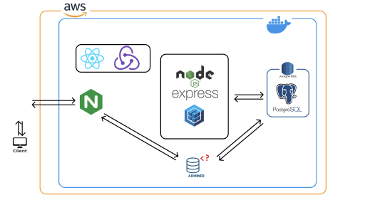
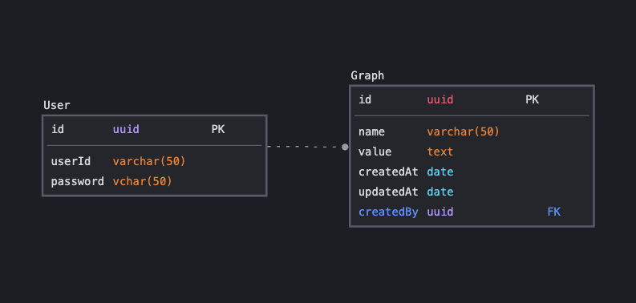

# Welcome to PF-STALKER

make your own graphs with data!

## 🌵 **Tech Stack**

### Dev-Ops

-  

### Frontend

-   

### Backend

-  

### DB

- 

## 🪵 System Architecture

## DESIGN

- [DESIGN](https://www.figma.com/file/rz8iXZPTunBGKM3hSSqdWx/Untitled?type=design&node-id=0-1&t=Pr3wFruJ5oQsdgv0-0)

## ROUTES

- [ROUTES LINK](./front/README.md)

## DB SCHEMA

## API

- [API LINK](./back/README.md)

## TESTCODE

- [TESTCODE LINK](./back/testcode/)

## Link

## 미구현

- bcrypt 를 통한 비밀번호 암호화
- jwt 를 활용한 유저 자격 증명
- httpOnly 활용
- S3 버킷 활용하여 대표 이미지 추가
- 그래프 검색 기능
- 유저 검색 기능
